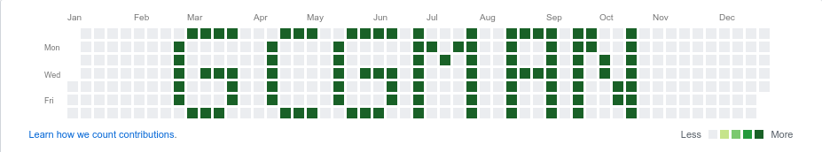
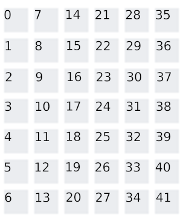
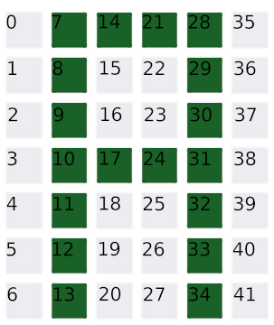

# Github Contribution Graph Manager (gcgman)

A python script to write words into your github contribution graph. Chosen word has a length limit
of 8.

Currently supported characters : 
A, B, C, D, E, F, G, H, I, J, K, L, M, N, O, P, R, S, T, U, V, Y, Z, X, W, Q, space, 0-9

## Installation
`pip3 install gcgman`

## Usage
`gcgman WORD [OPTION...]`

## Options

``` shell
    -h, --help                 show this help message and exit
    -p, --push                 Push commits from master branch to origin
    -y YEAR, --year YEAR       Use a year as a start date
    -c COUNT, --count COUNT    Number of commits per day
```

## Contribution
Each character can use maximum of 42 days (6 weeks or 6 colums). First and the last column is not
used if they are not necessary. gcgman treats each letter as a list of integers from 0 to 41.
Days used in drawing the letter are included in the list. Example of the letter 'A' can be seen
below.

### Empty Tiles vs Letter A
A = [7,8,9,10,11,12,13,14,17,21,24,28,29,30,31,32,33,34]


 
